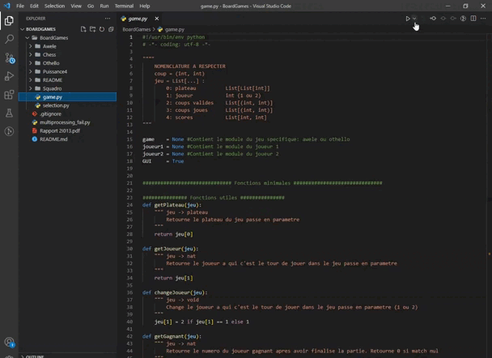
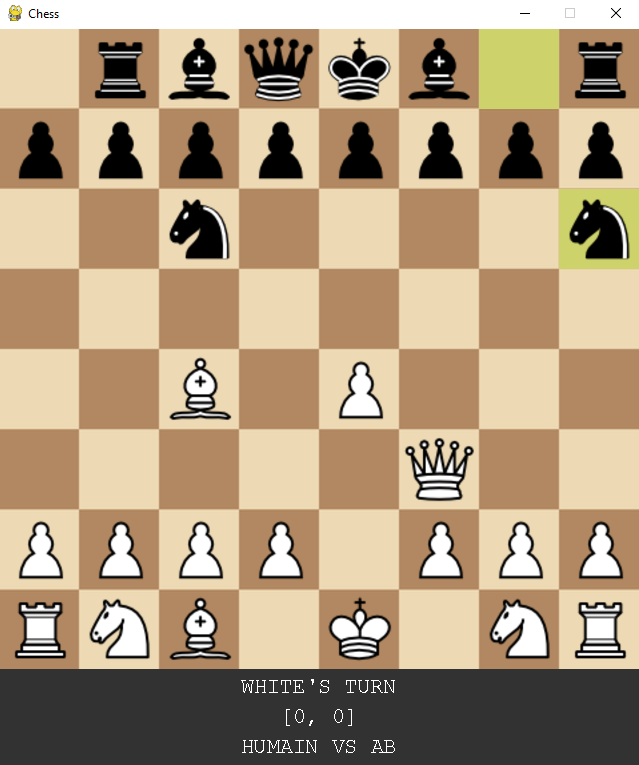
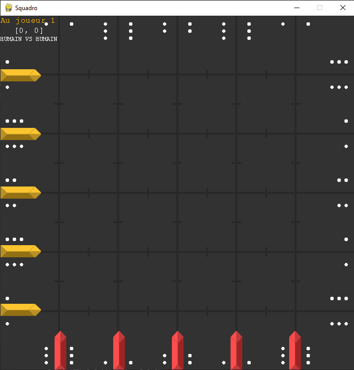
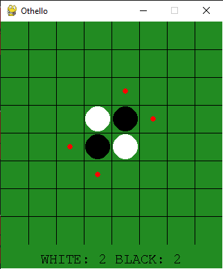
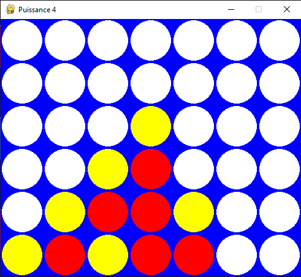

# Board Games

```bash
# python must be version 3
python --version
  Python 3.9.6

# run the app
pip install pygame
python game.py

# run genetic.py
pip install tqdm
python genetic.py
```

<div align="center">
  
</div>
<br>
<div>
  
  
  
  
</div>
