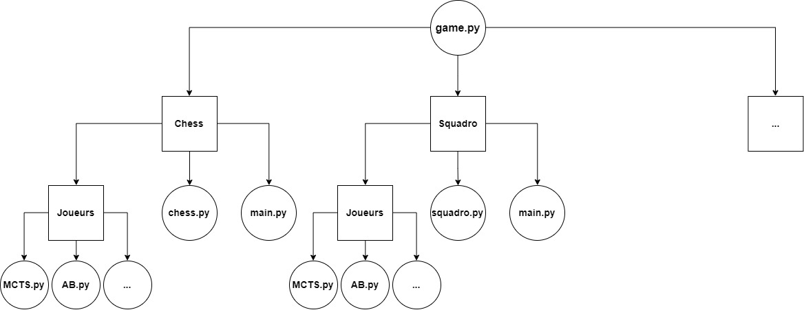

# ♟️ Board Games ♟️

[](https://badge.fury.io/py/stockfish) [](https://badge.fury.io/py/auto-py-to-exe) [](https://badge.fury.io/py/tqdm) [](https://badge.fury.io/py/pygame)


```bash
python --version
    Python 3.9.6

pip install -r requirements.txt

cd BoardGames/
python game.py
````

### Modules
